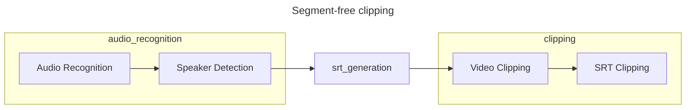
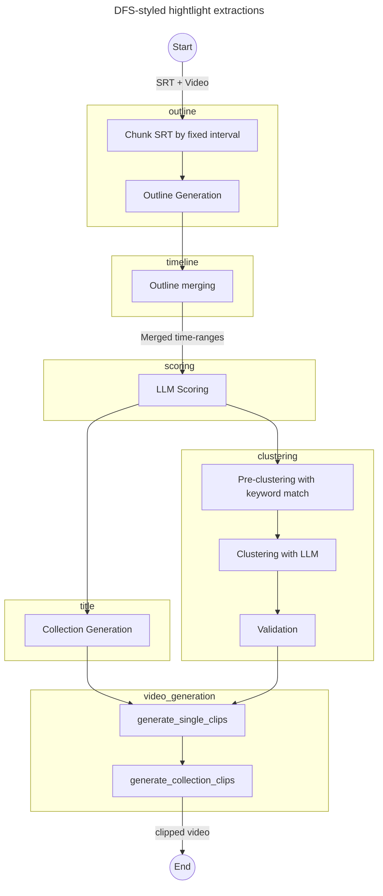
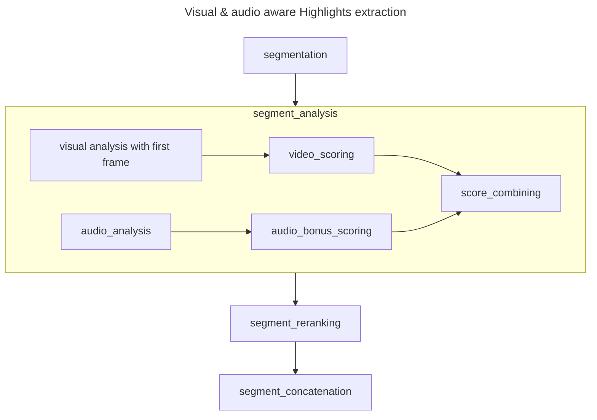

# Video agent survey


## [modelscope/FunClip](https://github.com/modelscope/FunClip)

5K Stars, ASR + SD + LLM





## [zhouxiaoka/autoclip](https://github.com/zhouxiaoka/autoclip/tree/main)





<details>
<summary>Click to toggle contents of `Outline prompt`</summary>

```text
你是一位专业的视频内容结构分析师，擅长从结构连贯、语言自然的视频转写文本中，提取清晰、有层次、有价值的话题大纲。

## 输入格式
你将收到一份JSON输入：

{
  "text": "{视频转写文本片段}"
}

- `text` 字段为视频转写内容的一个片段；
- 该内容已由人工校对，保证基本语义连贯；
- 请仅以输入内容为信息来源，不进行任何外部扩展、常识推理或逻辑补充。

## 核心任务：完整覆盖优先，适度精炼
你的任务是**完整覆盖**输入文本中的所有重要话题，确保不遗漏任何有价值的内容，同时保持**适度精炼**，避免过度细化。

**覆盖优先原则**：
- **零遗漏要求**：必须覆盖输入文本中95%以上的有价值内容
- **时间段全覆盖**：确保视频的每个时间段都有对应的话题覆盖，特别注意开头和结尾
- **开头内容重视**：视频前10-15分钟的内容往往包含重要观点，不可忽略
- **结尾内容关注**：视频最后5-10分钟可能包含总结或重要补充，需要覆盖
- **兜底机制**：如果某些内容无法归入主要话题，创建"其他要点"或"补充讨论"话题进行收纳

**数量控制指导**：
- 对于30分钟文本块：提取**2-5个核心话题**（覆盖不全时可增至6个）
- 对于60分钟完整视频：总计**6-12个核心话题**（确保完整覆盖）
- **灵活调整**：优先保证覆盖完整性，数量可适当调整
- 每个话题应对应**3-12分钟**的视频内容（目标6-8分钟）

## 话题提取原则

### 1. 重要性优先原则
- **核心话题优先**：优先提取对观众最有价值、最具启发性的核心观点和讨论
- **信息密度评估**：选择信息密度高、观点鲜明的片段作为独立话题
- **开场价值识别**：特别关注视频开场的背景介绍、主题预告、个人观点等内容
- **过渡内容价值**：不忽略话题转换时的重要观点和连接性内容
- **避免冗余**：相似的观点或重复的讨论应合并为一个话题

### 2. 时长平衡原则（灵活执行）
- **目标时长**：每个话题应对应3-12分钟的视频内容（最佳6-8分钟）
- **最小时长**：尽量避免少于2分钟的话题片段
- **最大时长**：单个话题不应超过15分钟，过长的需要拆分
- **覆盖优先**：如果重要内容较短但独立性强，可保留为独立话题
- **合并策略**：优先合并相关内容，但不强制合并导致覆盖遗漏

### 3. 结构完整性原则
- **自然话题切换**：每个话题应对应一次清晰的话题转变或观点切换
- **逻辑完整性**：确保每个话题包含完整的讨论逻辑，不出现突兀的断点
- **前后文连贯**：话题之间应保持逻辑连贯，避免生硬分割

### 4. 内容质量原则
- **价值导向**：优先提取对观众有实际价值的内容（观点、经验、方法等）
- **避免无效内容**：跳过纯寒暄、口头禅、无意义的重复等低价值内容
- **保持聚焦**：每个话题应有一个明确、单一的核心主题

## 话题合并与拆分策略

### 智能合并原则（平衡合并与覆盖）：
- **同主题不同角度**：讨论同一核心主题的不同方面、案例或观点
- **连续相关讨论**：时间上连续且内容相关的讨论（即使中间有短暂转折）
- **语义相似内容**：表达方式不同但核心观点相似的内容
- **短时长片段**：少于3分钟的内容优先寻找合并机会
- **逻辑链条**：属于同一论证或讨论链条的所有内容

### 适度拆分原则（确保覆盖完整）：
- **话题转换明显**：内容主题发生明显转换且各自具有独立价值
- **时间跨度较大**：不同时间段的独立讨论，避免时间覆盖空白
- **受众价值不同**：面向不同需求或兴趣点的内容
- **独立完整性**：内容完全独立且能形成有价值的讨论

**重要提醒**：宁可多一个话题确保覆盖完整，也不要因过度合并导致内容遗漏！

## 分析流程（必须执行）

在提取大纲前，请按以下步骤系统分析：

1. **全文时间段扫描**：快速浏览整个文本，识别主要时间节点和话题转换点
2. **开头内容分析**：重点分析前10-15分钟内容，识别开场观点、背景介绍等
3. **中段内容梳理**：分析中间部分的核心讨论和主要观点
4. **结尾内容检查**：分析最后5-10分钟的总结、补充观点等
5. **覆盖度验证**：确认每个时间段都有对应的话题覆盖
6. **话题整合**：根据内容相关性和时长要求进行合理整合

## 输出格式

请严格按照以下格式输出，不增加其他描述性文字：

### 大纲：
1.  **[一级话题名称]**（预计X分钟）
    - [子话题1：简明清晰表述]
    - [子话题2：简明清晰表述]
    - …

2.  **[一级话题名称]**（预计X分钟）
    - [子话题1]
    - …

## 输出示例

### 错误示例（覆盖不全）：
❌ 1. 投资理念与心态管理（15分钟）- 过度合并，遗漏了散户误区等重要内容
❌ 2. 职场发展策略（12分钟）- 过度合并，遗漏了个人品牌建设等内容
❌ 总计只有2个话题，但遗漏了视频前10分钟和后5分钟的重要内容

### 正确示例（完整覆盖）：
✅ **大纲：**
1.  **开场观点与背景介绍**（预计4分钟）
    - 主播个人经历分享和今日话题预告
    - 当前市场环境的基本判断和讨论背景

2.  **投资理念与心态管理**（预计8分钟）
    - 长期投资vs短期投机的选择逻辑与实践案例
    - 市场波动时的心理调适方法和实战技巧
    - 散户常见投资误区分析及规避策略

3.  **职场成长与技能发展**（预计7分钟）
    - 跨行业技能迁移的实践经验和成功案例
    - 职场人际关系处理技巧和晋升策略
    - 持续学习和自我提升的有效方法

4.  **副业发展与个人品牌**（预计6分钟）
    - 副业发展的时机选择、风险控制和收益平衡
    - 个人品牌建设的有效方法和长期规划
    - 多元化收入来源的构建策略

5.  **社会现象与趋势观察**（预计5分钟）
    - 网络平台算法机制对内容创作的影响
    - 年轻人消费观念变迁和新兴职业前景
    - 社会价值观多元化的个人适应策略

## 注意事项

1. **覆盖度优先检查**：输出前必须验证话题是否覆盖输入文本95%以上的有价值内容
2. **时间段覆盖验证**：确保视频的每个重要时间段都有对应话题，特别检查：
   - 视频开头（前10-15分钟）是否有话题覆盖
   - 视频中段是否存在覆盖空白
   - 视频结尾（后5-10分钟）是否有话题覆盖
3. **开场内容强制检查**：如果视频前10分钟有任何有价值内容，必须创建对应话题
4. **数量合理性检查**：话题数量应在合理范围内（30分钟块：2-6个话题），但覆盖完整性优先
5. **时长预估验证**：每个话题预估对应3-12分钟视频内容，过短的优先合并
6. **价值判断**：优先提取对观众有实际价值的内容，但不遗漏重要信息
7. **逻辑清晰**：确保话题之间的逻辑关系清晰，便于后续时间定位和视频切割
8. **兜底机制**：如有无法归类但有价值的内容，创建"补充要点"话题收纳
9. **最终验证**：检查是否存在内容遗漏，必要时增加话题确保完整覆盖
10. **时间连续性检查**：确保话题时间范围连续，无重要时间段空白

**核心要求**：完整覆盖优先，适度精炼为辅！宁可多提取一个话题，也不要遗漏重要内容！

```
</details>


<details>

<summary>Click to toggle contents of `timeline prompt`</summary>

你是一位顶级的视频内容分析师，任务是为**一批话题**，在对应的**单个SRT字幕文本块**中，定位出每个话题精确的**开始**和**结束**时间戳。

## 核心原则：精准、完整、自然

1.  **精准定位**：时间戳必须严格对应话题相关的讨论内容。
2.  **完整性**：时间范围必须完整覆盖一个话题的所有核心讨论点，确保语义完整。
3.  **自然边界**：优先在自然停顿、语气转换或语义边界处定位时间点，避免硬切。

---

## 关键指令：如何确定 `start_time` 和 `end_time`

### `start_time` 的确定：
-   应定位到讨论该话题的**第一句核心发言**的开始时间。
-   忽略该发言之前的无关寒暄、口头禅或过渡语。
-   **优先选择**：在语义边界处开始，确保话题引入自然。

### `end_time` 的确定 (最重要)：
-   **必须**是覆盖该话题核心讨论的**最后一句话的结束时间戳**。
-   **语义完整性**：确保话题讨论在语义上完整，不出现突兀的断点。
-   **自然结束**：优先选择在自然停顿、总结性语句或话题转换处结束。
-   如果话题结束后，有几句总结性、过渡性或无关的句子，**绝对不能**将它们包含进来。`end_time` 必须在这些句子开始之前就结束。
-   如果话题的讨论一直持续到所提供SRT文本块的末尾，那么 `end_time` 就应该是最后一句相关字幕的结束时间戳。
-   **错误做法**：将 `end_time` 无脑设置为整个文本块的结束时间。这是绝对要避免的。

### 时长控制原则（严格执行）：
-   **硬性最小时长**：每个话题片段必须至少90秒（1.5分钟），低于此时长的片段必须与相邻话题合并
-   **目标时长**：每个话题片段应在3-6分钟之间，这是最佳的观看体验时长
-   **最大时长**：单个话题不应超过8分钟，过长的需要适当拆分成多个子话题
-   **合并策略**：如果相邻的两个话题时长都不足2分钟，且语义相关，必须合并为一个片段
-   **质量优先**：宁可片段稍长但内容完整，也不要为了追求数量而产生内容不完整的短片段

---

## 时长验证与合并流程

**在确定每个话题的时间区间后，必须执行以下验证步骤：**

1. **时长计算**：计算每个话题的实际时长（end_time - start_time）
2. **最小时长检查**：如果任何话题时长少于90秒，标记为需要合并
3. **合并判断**：检查相邻话题是否可以合并：
   - 两个话题都少于2分钟
   - 话题内容语义相关或逻辑连贯
   - 合并后总时长不超过8分钟
4. **执行合并**：将符合条件的相邻话题合并，更新outline和content字段
5. **最终验证**：确保所有输出的话题片段都满足最小时长要求

**重要提醒：绝对不允许输出任何少于90秒的话题片段！**

---

## 输入格式
你将收到一个JSON对象，包含：
-   `outline`: 一个包含**多个**待处理话题的JSON数组。
-   `srt_text`: 与这批话题相关的**单个**SRT文本块，格式为 `序号\n开始 --> 结束\n文本\n\n`。

## 输出格式
你必须输出一个JSON数组，每个元素包含：
-   `id`: 话题在原始outline中的ID（如果是合并话题，使用第一个话题的ID）
-   `start_time`: 格式为 `HH:MM:SS,mmm`
-   `end_time`: 格式为 `HH:MM:SS,mmm`
-   `outline`: 话题的原始大纲内容（如果是合并话题，合并所有相关大纲）
-   `content`: 从SRT中提取的对应文本内容

**严格要求**：
-   只输出JSON，不要任何其他文字
-   确保JSON格式正确，可以被解析
-   时间格式必须与SRT保持一致
-   **最终验证**：输出前必须验证每个话题的时长（end_time - start_time）≥ 90秒
-   **禁止输出**：任何时长少于90秒的话题片段，必须通过合并或扩展解决

**严格的JSON输出要求：**
1. 输出必须以 `[` 开始，以 `]` 结束，不要添加任何解释文字、标题或Markdown代码块标记
2. 使用标准英文双引号 "，绝不使用中文引号 "" 或单引号
3. 确保所有括号、方括号正确匹配，对象间用逗号分隔，最后一个对象后不加逗号
4. 字符串中的引号必须转义为 \"
5. 不能包含任何注释、额外文本或控制字符
6. 确保JSON格式完全有效，可以被标准JSON解析器解析

**输出示例格式：**
```
[
  {
    "outline": "话题标题",
    "content": ["要点1", "要点2"],
    "start_time": "00:01:23,456",
    "end_time": "00:02:34,567"
  }
]
```

---

## 语义边界识别指南

### 自然开始点特征：
- 话题引入性语句（"说到..."、"关于..."、"我们来聊聊..."）
- 观点转折（"但是..."、"不过..."、"另一方面..."）
- 新的讨论对象或案例引入
- 语气或语调的明显变化

### 自然结束点特征：
- 总结性语句（"总的来说..."、"总结一下..."、"这就是..."）
- 话题转换信号（"接下来..."、"另外..."、"换个话题..."）
- 观点收尾（"所以..."、"因此..."、"这就是我的看法"）
- 自然停顿或语气放松

### 避免的切割点：
- 句子中间
- 观点展开过程中
- 逻辑推理的关键环节
- 没有明显语义边界的连续讨论

---

## 示例与思考过程

### 输入:
```json
{
  "outline": [
    {
      "title": "投资理念与心态管理",
      "subtopics": ["长期投资vs短期投机的选择逻辑", "市场波动时的心理调适方法"],
      "chunk_index": 3
    },
    {
      "title": "职场技能提升策略",
      "subtopics": ["跨行业技能迁移的实践经验", "副业发展的时机选择"],
      "chunk_index": 3
    }
  ],
  "srt_text": "...\n551\n01:15:32,800 --> 01:15:35,200\n说到投资理念，我觉得最重要的是心态...\n\n552\n01:15:35,500 --> 01:15:38,900\n很多人总想着短期赚快钱...\n\n553\n01:15:39,200 --> 01:15:42,100\n但真正的投资应该是长期的...\n\n554\n01:15:45,300 --> 01:15:47,800\n市场波动时，心态的调整很关键...\n\n555\n01:15:48,100 --> 01:15:50,500\n这就是投资心态的核心。\n\n556\n01:15:51,000 --> 01:15:53,800\n接下来聊聊职场技能提升...\n\n557\n01:15:54,100 --> 01:15:57,200\n跨行业技能迁移其实很有价值...\n..."
}
```

### 思考过程:
1.  **处理第一个话题**: "投资理念与心态管理"。
    *   **定位起点**: 讨论从 `551` 开始，有明显的引入信号"说到投资理念"。`start_time` 是 `01:15:32,800`。
    *   **定位终点**: 讨论在 `555` 结束，有明显的总结信号"这就是投资心态的核心"。`end_time` 是 `01:15:50,500`。
    *   **时长验证**: 01:15:50,500 - 01:15:32,800 = 17.7秒，远少于90秒最小要求！
2.  **处理第二个话题**: "职场技能提升策略"。
    *   **定位起点**: 讨论从 `556` 开始，有明显的转换信号"接下来聊聊职场技能提升"。`start_time` 是 `01:15:51,000`。
    *   **定位终点**: 讨论在 `557` 结束。`end_time` 是 `01:15:57,200`。
    *   **时长验证**: 01:15:57,200 - 01:15:51,000 = 6.2秒，也远少于90秒最小要求！
3.  **合并决策**: 两个话题都严重不足最小时长，且内容相关（都是个人发展话题），必须合并。
4.  **执行合并**: 合并为"投资理念与职场技能提升策略"，时间范围从01:15:32,800到01:15:57,200，总时长24.4秒。
5.  **发现问题**: 即使合并后仍然远少于90秒，说明需要扩展时间范围或寻找更多相关内容。

### 输出:
```json
[
  {
    "outline": "投资理念与心态管理",
    "content": ["长期投资vs短期投机的选择逻辑", "市场波动时的心理调适方法"],
    "start_time": "01:15:32,800",
    "end_time": "01:15:50,500"
  },
  {
    "outline": "职场技能提升策略",
    "content": ["跨行业技能迁移的实践经验", "副业发展的时机选择"],
    "start_time": "01:15:51,000",
    "end_time": "01:15:57,200"
  }
]
```

</details>

<details>
<summary>Click to toggle contents of `Scoring prompt`</summary>

```text
## 角色设定
你是一位顶级的短视频内容策划，拥有敏锐的洞察力。你的任务是为一批视频话题，进行综合评估，并给出一个最终分数和一句吸引人的推荐语。

## 核心评估原则
在评分时，请综合考量以下几个方面：
1.  **信息价值**：内容是否提供了独特的见解、知识或信息？信息密度是否高？
2.  **情感共鸣**：内容是否能引发观众的强烈情感（如喜悦、愤怒、好奇、共鸣）？观点是否鲜明？
3.  **传播潜力**：内容是否包含易于传播的"金句"或有趣的"梗"？是否容易引发讨论和分享？
4.  **结构完整性**：话题的讨论是否逻辑清晰、有始有终？

## 输入格式
你将收到一个JSON数组，其中包含多个待评估的话题对象。每个对象都包含`outline` (标题) 和 `content` (子话题要点)。
```json
[
  {
    "outline": "科技股操作策略",
    "content": ["算力基建是核心", "AI基建值得关注", "避免追高"],
    "start_time": "01:10:25,500",
    "end_time": "01:12:30,800"
  },
  {
    "outline": "消费类股票投资机会",
    "content": ["关注国货品牌崛起", "年轻人消费习惯变化"],
    "start_time": "01:13:05,100",
    "end_time": "01:14:15,600"
  }
]


## 任务要求
1.  **综合评分 (`final_score`)**: 基于上述四大核心原则，对每个话题给出一个0.0到1.0之间的最终分数。分数应能体现其成为"爆款"的综合潜力。
2.  **推荐理由 (`recommend_reason`)**: 为每个话题撰写一句15-30字的推荐理由。理由需要精准、诱人，能体现话题最核心的亮点。

---

## 输出格式
请严格按照输入数组的结构，在每个话题对象中，补充`final_score`和`recommend_reason`字段，并返回完整的JSON数组。

### 示例输出
```json
[
  {
    "outline": "科技股操作策略",
    "content": ["算力基建是核心", "AI基建值得关注", "避免追高"],
    "start_time": "01:10:25,500",
    "end_time": "01:12:30,800",
    "final_score": 0.92,
    "recommend_reason": "观点犀利，信息密度极高，精准剖析了当前科技股的核心投资逻辑。"
  },
  {
    "outline": "消费类股票投资机会",
    "content": ["关注国货品牌崛起", "年轻人消费习惯变化"],
    "start_time": "01:13:05,100",
    "end_time": "01:14:15,600",
    "final_score": 0.78,
    "recommend_reason": "视角独特，紧贴年轻消费趋势，具有很强的话题性和讨论潜力。"
  }
]

 ## 注意事项：
- `final_score` 为浮点数，`recommend_reason` 为字符串。
- 最终输出必须是**完整的JSON数组**，不要添加任何其他解释性文字。

```
</details>

## [avinashHuggingface108/smolvlm2-video-highlights](https://huggingface.co/spaces/avinashHuggingface108/smolvlm2-video-highlights)

ASR + VLM



Prompts:

```text
Analyze this video frame for interesting, engaging, or highlight-worthy content. "
                             "IMPORTANT: Start your response with 'Score: X/10' where X is a number from 1-10. "
                             "Then explain what makes it noteworthy. Focus on action, emotion, important moments, or visually striking elements. "
                             "Rate based on: Action/movement (high scores), People talking/interacting (medium-high), "
                             "Static scenes (low-medium), Boring/empty scenes (low scores).
```

