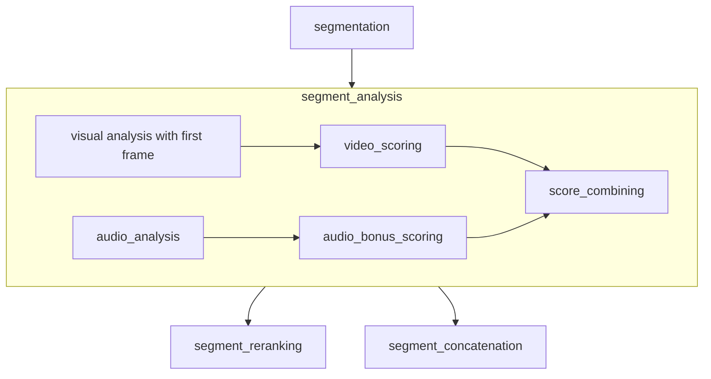

# Video agent survey


## [avinashHuggingface108/smolvlm2-video-highlights](https://huggingface.co/spaces/avinashHuggingface108/smolvlm2-video-highlights)

Features: video highlights extraction



Prompts:

```text
Analyze this video frame for interesting, engaging, or highlight-worthy content. "
                             "IMPORTANT: Start your response with 'Score: X/10' where X is a number from 1-10. "
                             "Then explain what makes it noteworthy. Focus on action, emotion, important moments, or visually striking elements. "
                             "Rate based on: Action/movement (high scores), People talking/interacting (medium-high), "
                             "Static scenes (low-medium), Boring/empty scenes (low scores).
```

